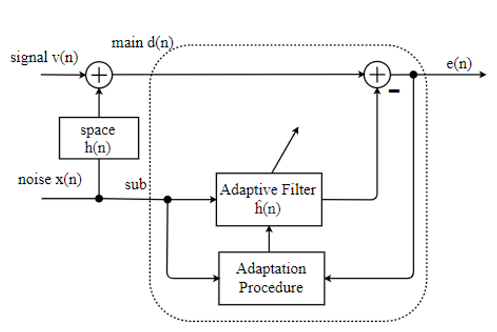
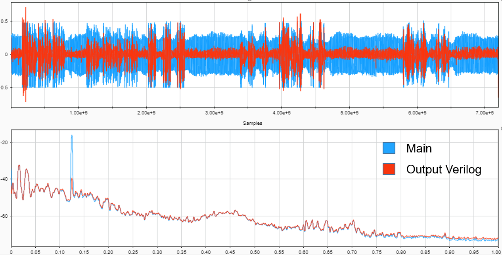

# **ReduceNoiseUse2Mic**

Programming by Verilog

## **Specifications**:

### **Functional Requirements**

Speech noise reduction circuit using 2 mics

- Audio is captured by 2 mics, one close to the speaker, a mic far away from the speaker and near the source of f-frequency noise
- Output is noise
- reduced speech audio data - Output data can be output directly to the speaker in real time
- Has a Start button: Get started receive input
- There is a Reset button: Resets the state of the circuit to the initial state

### **Non-functional requirement**

- The two processing inputs correspond to the 2 below quantized audio signals 8-bit format, with a sampling rate of 16kHz
- Output is processed 8-bit data with a 16kHz recovery frequency
- The collated output is generated by implementing the algorithm on Matlab with the same input signal
- Evaluation: The circuit output is compared with the collated input and output through the SNR and PESQ index

## **Algorithm Diagram**

The block diagram of the circuit will consist of two main blocks: Adaptive Filter and Adaption Procedure.

Inputs are two main and sub signals.

The LMS algorithm uses a filter with an adaptive coefficient such that the mean squared error is minimal.

Objective: find the coefficient of ĥ(n) closest to h(n) to subtract noise from the speech.

## **Kết quả**

The first figure is the signal shape in the time domain, it can be seen that the Verilog output has the same form as the main input output but with less noise

The second figure is the spectrum. signal, it can be seen that the 1000Hz noise is significantly reduced, the remaining frequency bands are kept the same shape and intensity -> this greatly affects the PESQ index, especially with the frequency range of the voice. from 60Hz to 280Hz
